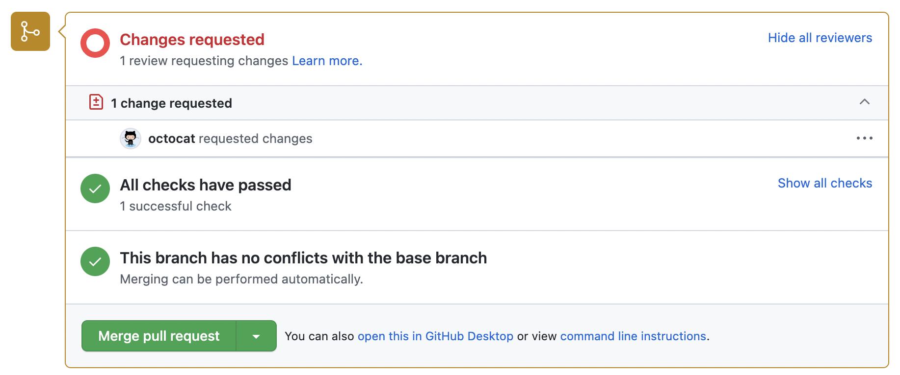

# Prueba

**Lo amarillo** es *modificación de algo ya existente* en Git.  
**Lo verde** es *algo nuevo* agregado al repositorio.  
**Y lo rojo** es *algo que está mal* o debe corregirse.

## Comandos para subir esto a Git

- `git checkout -b "texto"` – Cambia a la rama `"texto"` 
- `git add .` – 
- `git commit "Descripción de los cambios"` – 
- `git push  `

## no colocar espacios en las ramas siempre nombre/#numero-de-tarea

